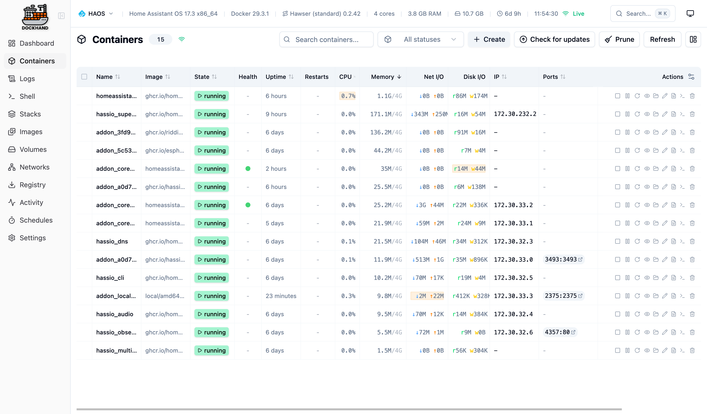
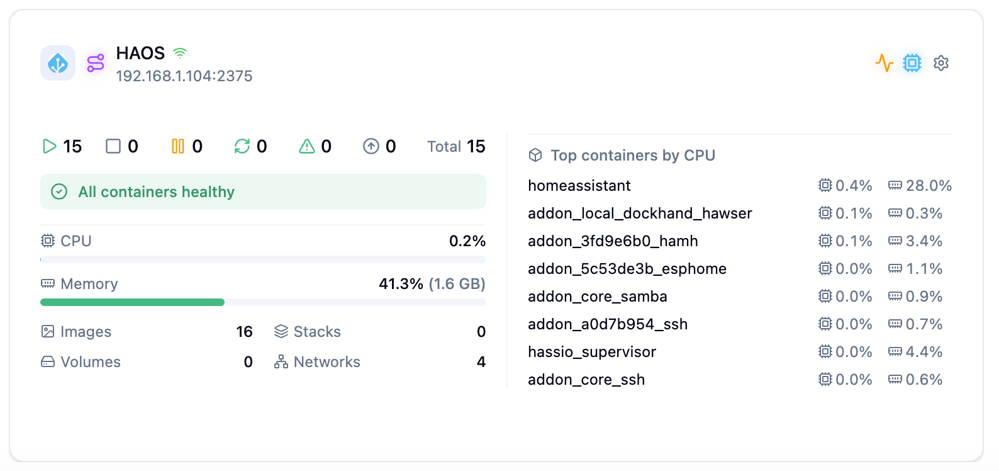
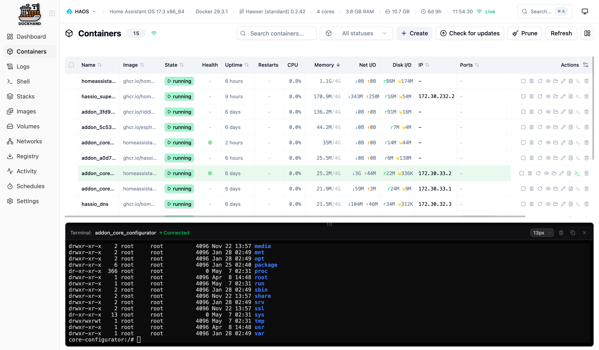

# Home Assistant Add-on: Hawser Agent for Dockhand

![Supports aarch64 Architecture][aarch64-shield]
![Supports amd64 Architecture][amd64-shield]
![Supports armv7 Architecture][armv7-shield]
![Doesn't support armhf Architecture][armhf-shield]
![Doesn't support i386 Architecture][i386-shield]

_Run the Hawser agent inside Home Assistant to let [Dockhand](https://dockhand.pro) manage your HA Docker host — containers, images, networks, volumes and Compose stacks — from anywhere._

  

## About

[Hawser](https://github.com/Finsys/hawser) is a lightweight Go agent that
bridges a Docker host to a [Dockhand](https://dockhand.pro) server. This add-on
runs it inside Home Assistant, so Dockhand can manage the Docker environment
your HA instance lives on.

It supports both **Edge** mode (the agent dials out to Dockhand — best behind
NAT or on a dynamic IP) and **Standard** mode (the agent listens for
connections from Dockhand — best on a LAN with a stable address).

The Hawser binary is **not** baked into the add-on image. On first start the
add-on downloads the matching upstream release for your architecture from
GitHub, verifies its SHA256 against the official `checksums.txt`, and caches it
on the persistent `/data` volume — keeping the add-on image small and the
upgrade path simple.

## Add-ons in this repository

- **[Hawser Agent for Dockhand](dockhand_hawser)** — runs the Hawser agent
  (Edge or Standard mode). Binary downloaded and SHA256-verified on first
  start, cached on `/data`.

## Installation

1. In Home Assistant, go to **Settings → Add-ons → Add-on Store**.
2. Open the **⋮** menu (top right) → **Repositories**.
3. Paste this repository URL and click **Add**:
   `https://github.com/Malith-Rukshan/addon-dockhand-hawser`
   — or just click the badge above, which both adds the repo and jumps you
   straight to this add-on's page.
4. The **Hawser Agent for Dockhand** add-on now appears in the store. Install it.
5. On the add-on's **Info** page, toggle **Protection mode → OFF** (required —
   the agent needs access to the host's Docker socket; Home Assistant guards
   that behind Protection mode).
6. Open the add-on's **Configuration** tab, set at minimum `dockhand_url` and
   `token` (for the default Edge mode), then **Start**.

See the add-on's [DOCS.md](dockhand_hawser/DOCS.md) for everything else,
including Standard mode setup and the mixed-content gotcha when adding the host
in Dockhand over HTTPS.

## Requirements

- Home Assistant OS or Supervised (the add-on uses the Supervisor — won't work
  on HA Container or HA Core).
- Outbound internet access on first start, to pull the Hawser binary from
  GitHub releases.

## Once it's connected

Your Home Assistant host shows up in Dockhand as a regular Docker host. From
there you get a live overview card with container counts, CPU/memory and the
top-CPU containers:

  

…the full container list with state, image, uptime and resource usage, and a
built-in terminal for exec'ing into any container:

  

## Support

Issues and pull requests are welcome:
<https://github.com/Malith-Rukshan/addon-dockhand-hawser/issues>.

## License

[MIT](LICENSE). Upstream Hawser is MIT-licensed by Finsys.

[aarch64-shield]: https://img.shields.io/badge/aarch64-yes-green.svg
[amd64-shield]: https://img.shields.io/badge/amd64-yes-green.svg
[armhf-shield]: https://img.shields.io/badge/armhf-no-red.svg
[armv7-shield]: https://img.shields.io/badge/armv7-yes-green.svg
[i386-shield]: https://img.shields.io/badge/i386-no-red.svg
